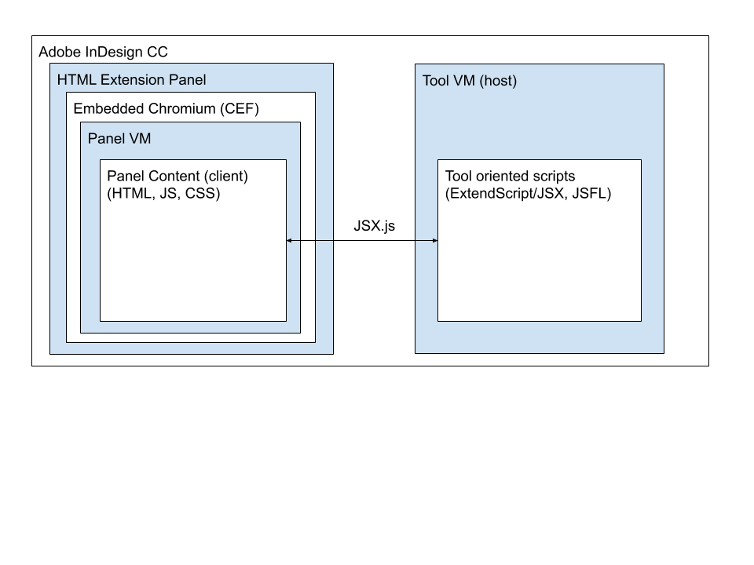

# Overview

This describes host specific configurations. There are two ways that you can execute host ExtendScript (*.jsx) files. The first is through the client CEP panel which uses JSX.js and the other is directly through the application's Script Panel.

# CEP Panel through JSX.js

We use the [JSX.js](https://creative-scripts.com/jsx-js/) (rather than Adobe's [CSInterface.js](https://github.com/Adobe-CEP/CEP-Resources/blob/master/CEP_9.x/CSInterface.js)) to handle executing JSX scripts and files. This diagram (based on [Andy Hall's diagram](http://aphall.com/2014/08/cep-5-tool-integration-en/)) describes the interacting VMs and how JSX.js connects them.



# Script Panel through Views

The InDesign Scripts Panel allows for directly executing ExtendScript without having to go through a panel. Make the host scripts available in the panel with the following commands:

```sh
TMPUSER=`whoami`
sudo ln -s "/Users/$TMPUSER/projects/cep-bootstrap/host" "/Applications/Adobe InDesign CC 2019/Scripts/Scripts Panel/cep-bootstrap"
```

Then open the Window > Utility > Scripts panel. You should now see cep-bootstrap available in the panel. Browsing to the `views/` folder should allow you to execute the scripts directly.

# Logging

Logging in ExtendScript can be done through the `host/models/Logger.jsx` class. Output of logging is in the `host/logs/host.log` file.

Console logging can be seen by opening the debug server in the browser.

# Testing

Tests are run using the `host/tests/run.sh` script. It executes AppleScript to run the `tests/run.jsx` which loads a modified [jasminejsx](https://github.com/tmaslen/jasminejsx) bootstrap file. [jasmine](https://jasmine.github.io) specs are then run.

<!--
TODO: Running tests using jasminejsx through the [VSCode's ExendScript Debugger](https://marketplace.visualstudio.com/items?itemName=Adobe.extendscript-debug) which is Adobe's replacement for [ExtendScript Toolkit](https://www.adobe.com/devnet/scripting/estk.html).
-->
